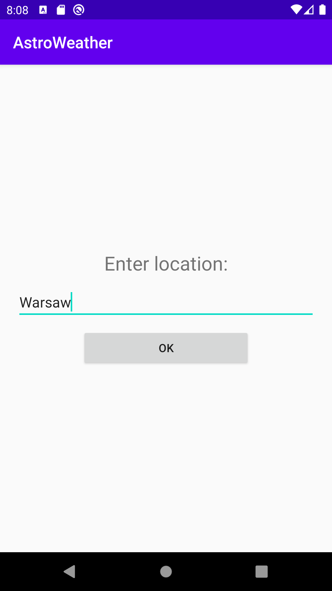
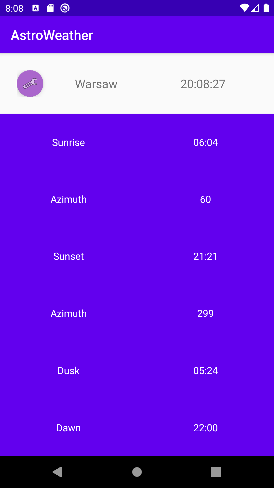
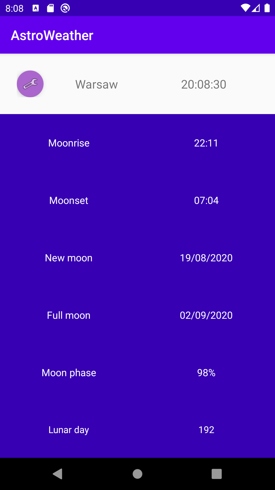
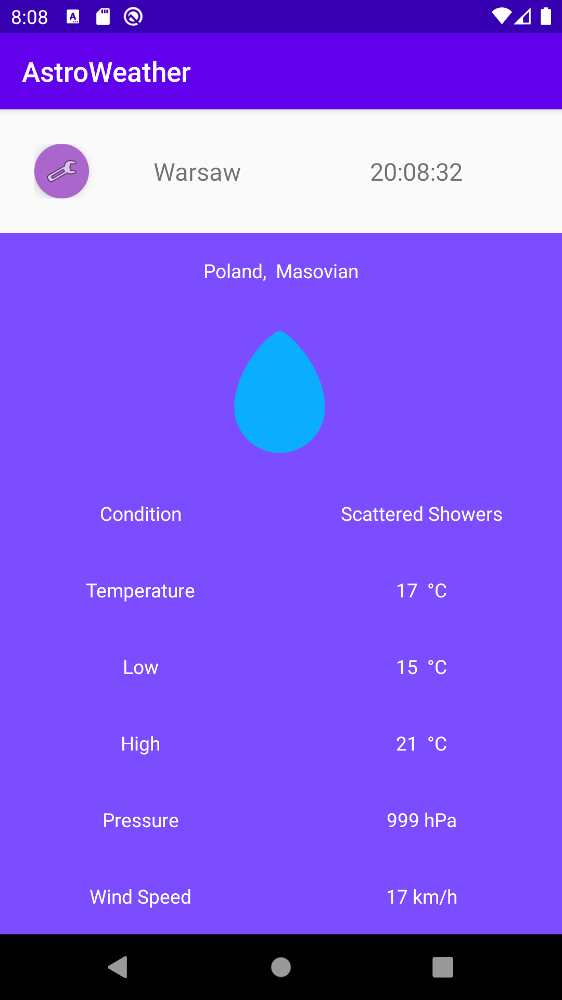
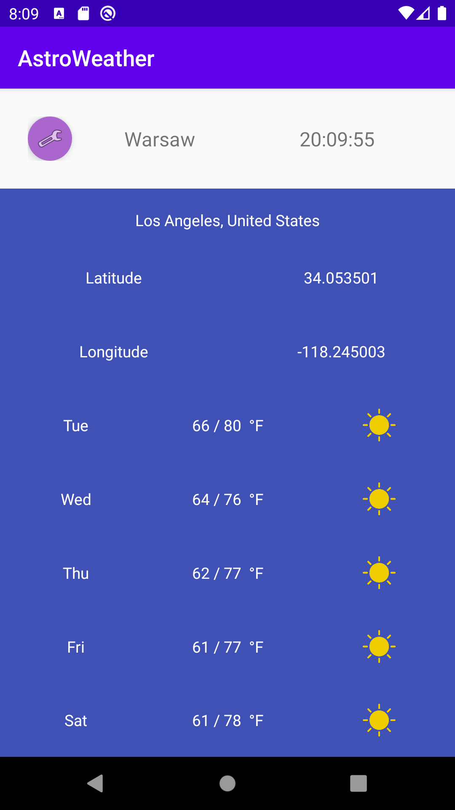
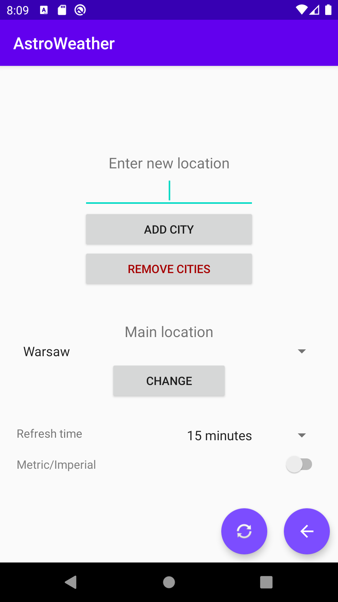

# Astroweather
Application was created for laboratories on my university classes. 
It's goal is to display calculations about sun and moon, display weather predictions.

## Requirements
Android, API level: 26

# Usage 
## First steps
First time you use the application, you will be asked to enter default location. If you are online, data about this place will be downloaded from Amazon's weather API. Otherwise, location is set to Łódź (Poland) and you will only be able to display calculations about sun and moon. If you have already set main location, you won't be asked anymore for location (you may change it later in preferences).

## Features
Three firsts fragments are always displaying information about sun and moon and today's weather for the main location. You can also add unlimited number of other locations. For every added place there will be one fragment created - showing weather predicts for a few days ahead.

## Preferences menu
In the preferences menu you will find some helpful options:
* Add city - adds new location to the list
* Remove cities - deleted every location except the default one 
* Main location list - lets you choose your main location from the list of all the places you have added 
* Refresh time - says how often information about weather will be downloaded
* Metric/imperial - changes units (metric is default)
* Left button - downloads data from the Internet immedietly (and refreshes weather data)
* Right button - takes you back to the application view

# Credits

## Icons used in an application:
The Weather is Nice Today (c) by Laura Reen
https://www.iconfinder.com/iconsets/the-weather-is-nice-today

The Weather is Nice Today is licensed under a
Creative Commons Attribution-NonCommercial 3.0 Unported License.
https://creativecommons.org/licenses/by-nc/3.0/
